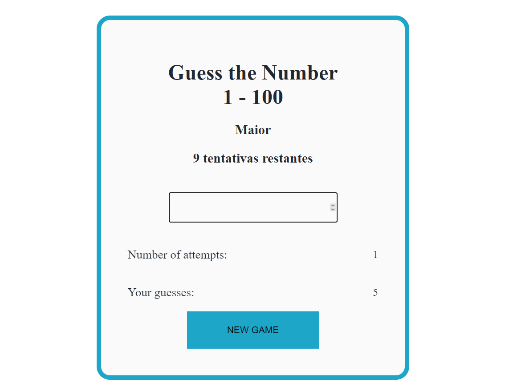

# 🎯 Adivinhe o Número

Um jogo simples de adivinhação onde o jogador tenta descobrir um número gerado aleatoriamente pelo computador.



## 🚀 Como funciona?

- O computador escolhe um número aleatório entre 1 e 100.
- O jogador tem **10 tentativas** para adivinhar o número correto.
- A cada tentativa, o jogo informa se o número correto é **maior** ou **menor** do que o número digitado.
- O jogo termina quando o jogador acerta ou esgota todas as tentativas.

## 🛠 Tecnologias usadas

- HTML
- CSS
- JavaScript

## 📂 Como jogar

1. Clone o repositório:
   ```bash
   git clone https://github.com/eliasnlima/adivinhe-o-numero.git

2. Abra o arquivo index.html no navegador.

3. Digite um número no campo de entrada e pressione Enter.

4. Siga as dicas do jogo até acertar o número ou esgotar as tentativas.

5. Para jogar novamente, clique no botão de Novo Jogo.