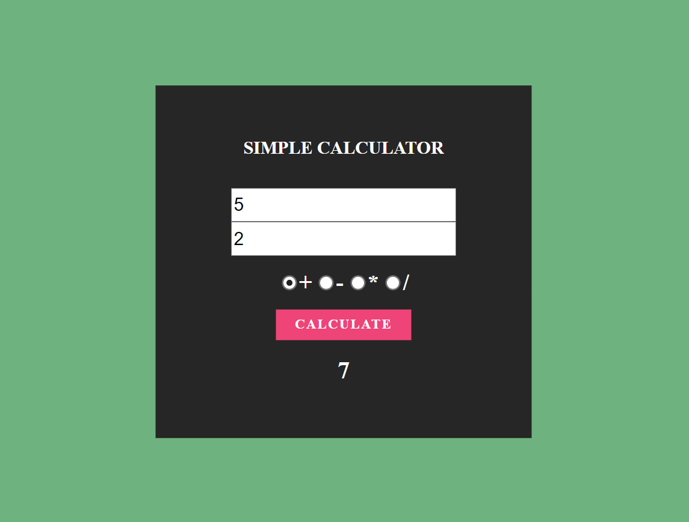

# 🧮 Calculadora Simples

Um projeto básico de calculadora que realiza operações matemáticas entre dois números.



## 🚀 Como funciona?

- O usuário insere dois números nos campos de entrada.
- Seleciona a operação desejada:
  - ✅ Adição (+)
  - ✅ Subtração (-)
  - ✅ Multiplicação (×)
  - ✅ Divisão (÷)
- O resultado é exibido na tela.

## 🛠 Tecnologias usadas

- HTML
- CSS
- JavaScript

## 📂 Como usar

1. Clone o repositório:
   ```bash
   git clone https://github.com/eliasnlima/calculadora-simples.git

2. Abra o arquivo index.html no navegador.

3. Insira dois números nos campos indicados.

4. Escolha a operação desejada e veja o resultado aparecer automaticamente.
