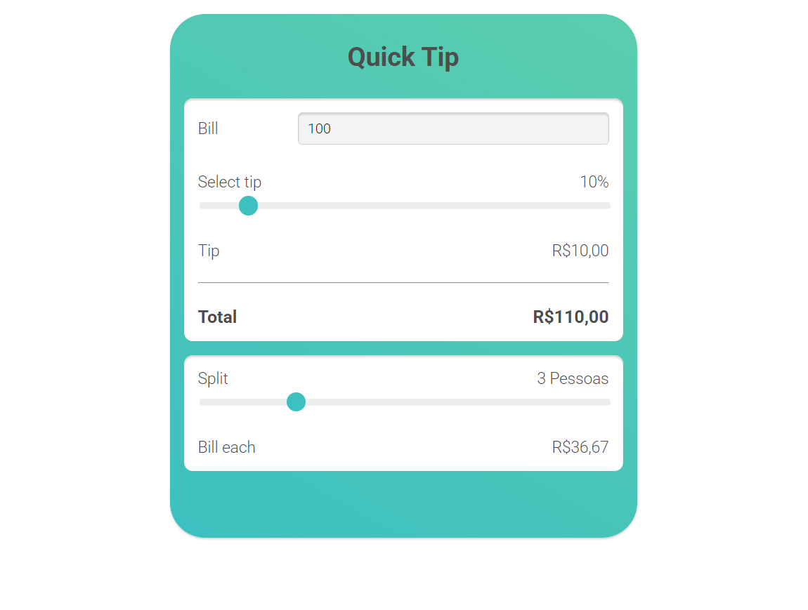

# 💰 Calculadora de Gorjeta e Divisão de Conta

Um aplicativo simples para calcular o valor da gorjeta e dividir a conta entre várias pessoas.



## 🚀 Como funciona?

- O usuário insere o valor total da conta.
- Escolhe a porcentagem da gorjeta a ser adicionada.
- Define quantas pessoas irão dividir a conta.
- O sistema calcula e exibe:
  - O valor da gorjeta.
  - O valor total da conta com a gorjeta incluída.
  - O valor que cada pessoa deve pagar.

## 🛠 Tecnologias usadas

- HTML
- CSS
- JavaScript

## 📂 Como usar

1. Clone o repositório:
   ```bash
   git clone https://github.com/eliasnlima/calculo-comanda.git

2. Abra o arquivo index.html no navegador.

3. Insira os valores necessários nos campos.

4. Veja o cálculo automático atualizado conforme altera os valores.