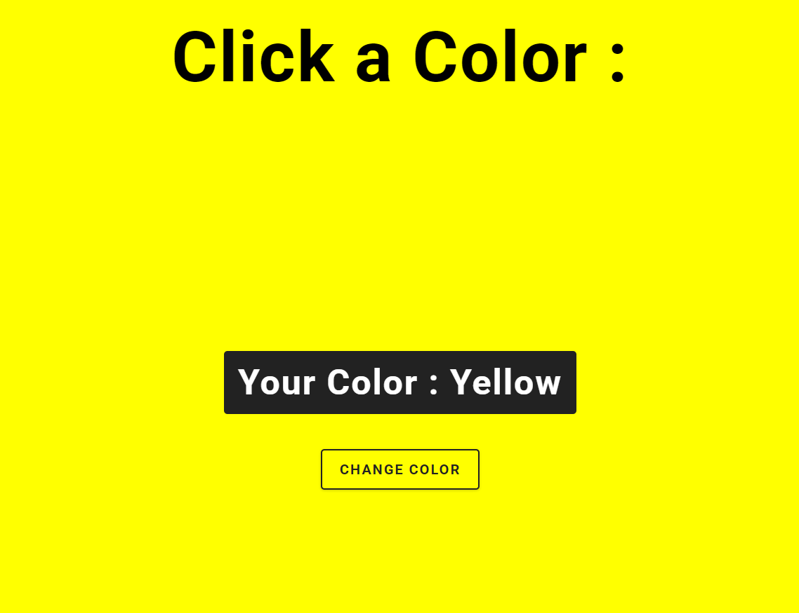

# 🎨 Change Background Color

Um projeto simples em JavaScript para alterar a cor de fundo da página ao clicar em um botão.



## 🚀 Como funciona?

- Ao clicar no botão, a cor de fundo da página muda aleatoriamente para uma das cores predefinidas.
- A cor selecionada também é exibida na tela.

## 🛠 Tecnologias usadas

- HTML
- CSS
- JavaScript

## 📂 Como usar

1. Clone o repositório:
   ```bash
   git clone https://github.com/eliasnlima/escolha-a-cor.git
   ```
2. Abra o arquivo `index.html` no navegador.
3. Clique no botão e veja a magia acontecer! 🎨✨


